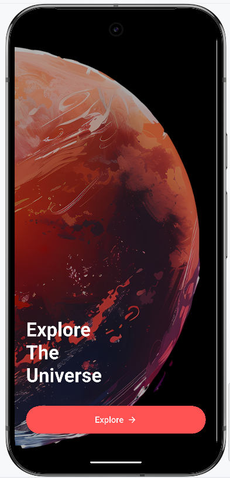

# 🌌 Space Exploration App 🚀

This Flutter application provides an interactive experience where users can explore the planets in our solar system through informative pages and immersive 3D models.

---

## ✨ Features

- 🚀 **Splash Screen**  
  Beautiful animated splash screen with branding transition.

- 🔐 **Login Screen**  
  Simple login screen placeholder for future authentication.

- 🌍 **Home Screen**
  - AppBar with background graphic.
  - Scrollable planet carousel using `PageView`.
  - Planet navigation with an "Explore" button.

- 📊 **Planet Details Screen**
  - Detailed planet information (distance, day length, radius, gravity, etc.).
  - 3D model viewer using `model_viewer_plus`.
  - Custom header with dynamic content.
  - Scrollable design for accessibility.

- 🧠 **Data Handling**
  - Planet data is stored in a structured Dart list (`planet_data.dart`).
  - Dynamic asset loading (images and `.glb` 3D models).

---

## 🛠️ Technologies Used

| Purpose                  | Tech/Library                          |
|--------------------------|----------------------------------------|
| Mobile UI                | [Flutter](https://flutter.dev)         |
| 3D Model Integration     | [`model_viewer_plus`](https://pub.dev/packages/model_viewer_plus) |
| Navigation               | `Navigator.push` for screen routing    |
| State Management         | `StatefulWidget` and `setState()`      |
| Image & Model Assets     | `assets/` folder via `pubspec.yaml`    |

---

## 📂 Folder Structure

```
lib/
├── main.dart
├── splash_screen.dart
├── login_screen.dart
├── home_screen.dart
├── planet_detail_screen.dart
├── planet_data.dart
├── navigation_push_example.dart
assets/
├── image/
│   ├── earth.png, mars.png, etc.
│   └── Rectangle 4.png (header bg)
├── models/
│   ├── earth.glb, mars.glb, etc.
├── screens/
│   ├── splash.png
│   ├── home.png
│   └── detail.png
```

---

## ✅ How to Run

1. **Clone the repo**
   ```bash
   git clone https://github.com/your-username/space_explorer_app.git
   cd space_explorer_app
   ```

2. **Install dependencies**
   ```bash
   flutter pub get
   ```

3. **Run the app**
   ```bash
   flutter run
   ```

---

## 🖼️ Screenshots

| Splash Screen               | Home Screen                | Planet Detail Page        |
|----------------------------|----------------------------|---------------------------|
|  |  |  |

> 💡 To display screenshots, add them inside `assets/screens/` and update the paths above if needed.

---

## 🎥 Demo Video

https://user-images.githubusercontent.com/your-username/demo.mp4  
*(Upload your screen recording to GitHub or YouTube and replace this link)*

---

## 🔧 Android Configuration

Make sure you have the following in your Android project:

### `AndroidManifest.xml`
```xml
<uses-permission android:name="android.permission.INTERNET"/>
<application
    android:hardwareAccelerated="true"
    android:usesCleartextTraffic="true"
    ... />
```

### `android/app/build.gradle`
```gradle
minSdkVersion 19
```

### If using 3D models on Android:
Make your `MainActivity` extend `FlutterFragmentActivity`:

```kotlin
class MainActivity: FlutterFragmentActivity() { }
```

---

## 📩 Contact

Feel free to reach out for suggestions, bug reports, or contributions:  
📧 **[fagerhu03@gmail.com](mailto:fagerhu03@gmail.com)**

---

> “The Earth is the cradle of humanity, but one cannot live in the cradle forever.”  
> — Konstantin Tsiolkovsky
